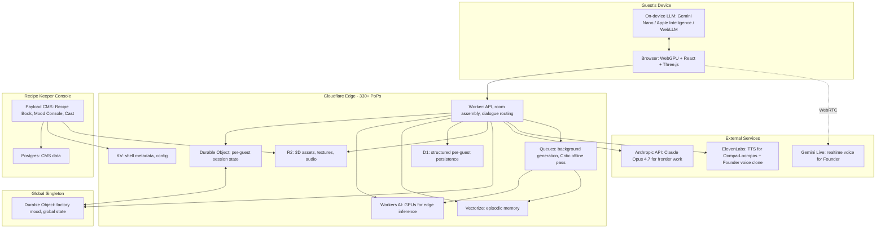
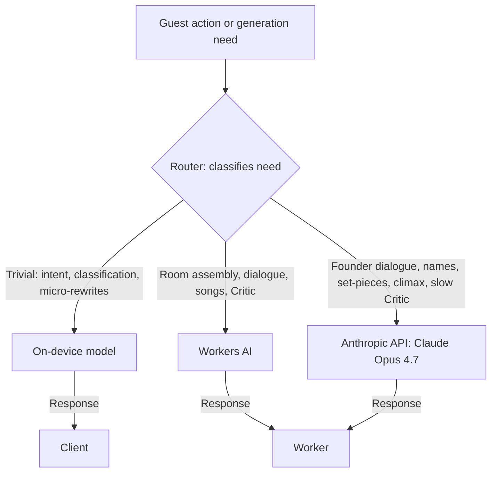

# The Confectory: Technical Architecture Specification

**Version 1.0**
**Prepared by the Chief Architect, for the Founder**
**End-of-Day Edition**

---

## 0. About this document

This is the engineering counterpart to the Translator's Design Spec. The Design Spec specifies *what* The Confectory is. This document specifies *how* we will build it.

This spec covers all major subsystems through Phase 1 of the build sequence and the architectural commitments that Phases 2-4 depend on. Decisions made in this document are binding unless escalated to the Founder. Decisions deferred to later are flagged in §24.

Throughout this document, "the system" refers to The Confectory in production. "We" refers to the build team. "The Founder" refers to the Founder. The Translator is responsible for design and content quality. The Architect (me) is responsible for everything else.

---

## 1. Architectural principles

These derive from the Design Spec, translated into engineering directives:

1. **Edge-first.** Generation, state, and inference live as close to the guest as possible. Round-tripping to a central region is a fallback, not a default.
2. **Streaming open world.** The factory pre-generates ahead of the guest. The guest never waits on generation that should have already happened.
3. **Rooms as budget.** Every room has a measured traversal-time floor that exceeds the worst-case generation budget for its downstream rooms. Room design and engine budget are the same problem.
4. **Taste is enforced at two tiers.** A fast inline Style Critic guards the path. A slow offline Critic trains the fast one and audits everything.
5. **Authored fallbacks exist for every generated thing.** When generation or the Critic fails, the system serves hand-crafted content silently.
6. **Diegetic over chrome.** UI surfaces are objects in the world. Not modals, not overlays. Where chrome is unavoidable, it is the minimum.
7. **The factory is one system.** Per-guest state, global state, and the Recipe Keeper CMS share one durable backend. No data lives in two systems.
8. **Operate on one platform.** We commit to Cloudflare for compute, storage, inference, and delivery. The integration cost of multi-cloud is not worth the marginal portability gain at this phase.

---

## 2. System overview



The architecture has four operating surfaces: the guest's browser, the Cloudflare edge, the global singleton (one Durable Object that owns factory-wide state), and the Recipe Keeper CMS (a separate Payload deployment). External services are limited to model providers we cannot self-host at the required quality (frontier LLM, realtime voice, TTS).

---

## 3. Technology stack

Each choice is deliberate. Each is defensible. Each can be replaced later but doing so is expensive enough that we should not unless something is broken.

### 3.1 Client

| Layer | Choice | Rationale |
|---|---|---|
| Language | TypeScript 5.x | Type safety across the full stack. Same language client and server. |
| Build tool | Vite 6.x | Fast HMR, minimal config, ESM-native. |
| Framework | React 19 | Mature ecosystem, R3F integration, team familiarity. |
| 3D | Three.js r170+ with WebGPU renderer | The mature option for browser 3D. WebGPU renderer is stable. |
| 3D composition | React Three Fiber + drei | Component model for 3D scenes. Declarative scene graphs. |
| Shaders | WGSL | Native to WebGPU. Hand-rolled toon/watercolor pipeline. |
| Physics | Rapier (Rust → WASM) | Deterministic, fast, well-maintained. Better than Cannon for our use. |
| Audio | Tone.js for mixing/scheduling; native Web Audio underneath | Procedural mixing of layered ambient + reactive score. |
| State (client) | Zustand | Lightweight, game-shaped state, no Redux bloat. |
| Server state | TanStack Query | Cache, retries, suspense integration. |
| Routing | TanStack Router | Type-safe, file-based, plays well with R3F. |

### 3.2 Edge compute

| Layer | Choice | Rationale |
|---|---|---|
| Runtime | Cloudflare Workers | V8 isolates, sub-5ms cold start, 330+ PoP global presence. |
| Framework | Hono | Lightweight, Workers-native, good DX. |
| Per-guest state | Durable Objects | Single-writer consistency per guest. Pinned to one location. |
| Global state | One Durable Object | The Confectory's mood, weather, cross-guest events. |
| Structured persistence | D1 (SQLite) | Per-guest visit history, name registry, ticket stub state. |
| Vector store | Vectorize | Episodic memory embeddings. Native to the platform. |
| Object storage | R2 | 3D meshes, textures, audio, generated assets. Zero egress fees. |
| KV | Workers KV | Shell metadata, config that needs global low-latency reads. |
| Background jobs | Cloudflare Queues | Offline Critic pass, asset processing, summarization. |
| Edge inference | Workers AI | Llama / Qwen / SD on GPUs in PoPs. The whole edge-AI thesis. |

### 3.3 Frontier and specialty models

| Use | Provider | Model |
|---|---|---|
| Founder dialogue, set-pieces, name generation, climax | Anthropic Messages API | Claude Opus 4.7 (string: `claude-opus-4-7`) |
| Realtime voice interaction (Founder, when interactive) | Google | Gemini 3.1 Flash Live (audio-native, 90+ languages, ~250-500ms turn latency) |
| TTS for Oompa-Loompas and pre-generated Founder lines | ElevenLabs | Turbo v3 with Professional Voice Clone for the Founder |
| Surface-level image generation (labels, packaging, paintings) | Workers AI | Flux Schnell or SDXL Turbo (sub-second edge) |

We document the model choice but isolate it behind a `ModelProvider` interface in code so we can swap. Specifically: `FoundryProvider`, `VoiceProvider`, `TTSProvider`, `ImageProvider`, `CriticProvider`. Each is implemented per concrete model.

For Claude Opus 4.7, we use the Anthropic TypeScript SDK and the Claude Agent SDK for any multi-turn agent loops we need. See https://docs.claude.com/en/api/overview for current API surface.

### 3.4 Storage strategy

| Data | Where | Why |
|---|---|---|
| Per-guest world state (visit history, consequences, ticket stub) | D1 + Durable Object cache | Strong consistency per guest, fast reads via DO. |
| Episodic memory (vectors + text) | Vectorize for vectors, D1 for source text | Semantic recall from Oompa-Loompas and the Founder. |
| Global factory state (mood, weather, events) | Single Durable Object | One writer, eventual consistency to all guest sessions. |
| Shell definitions (canonical) | KV (metadata) + R2 (assets) | KV for global low-latency reads. R2 for the heavy bits. |
| Generated assets (cached) | R2 with TTL | Reuse generations across guests where appropriate. |
| Telemetry events | Analytics Engine | Built for high-volume time-series. |
| CMS data (Recipe Keepers' authored content) | Postgres (Neon or self-hosted) via Payload | Payload requires Postgres or Mongo. Postgres is the right call. |

### 3.5 CMS and admin

| Layer | Choice | Rationale |
|---|---|---|
| CMS framework | Payload CMS 3.x | TypeScript-native, self-hostable, ships an admin UI, extensible with custom React. |
| Database | Postgres (Neon) | Payload's primary supported DB. Branchable for staging. |
| Custom UIs | Custom React panels (Mood Console, Critic's Notebook, Telemetry) | Specialty surfaces built on Payload's plugin system. |
| Auth (Recipe Keepers) | Better-Auth | Modern, TypeScript-native, RBAC, supports SSO and passkeys. |

### 3.6 Guest identity

| Need | Choice | Rationale |
|---|---|---|
| Anonymous session | Encrypted cookie + DO-pinned session ID | A guest can arrive without an account. The factory still tracks them. |
| Optional persistent account | WebAuthn / passkeys via Better-Auth | If a guest wants their history to persist across devices, they upgrade. No passwords. |
| Voice identity (future) | Voice print enrolled in session | Phase 3+. Not needed for Phase 1. |

### 3.7 Asset pipeline

| Step | Tool |
|---|---|
| Authoring (3D) | Blender |
| Delivery format | glTF 2.0 with Draco mesh compression and Meshopt |
| Textures | KTX2 / Basis Universal for transmission |
| Shell upload | Custom CLI (`confectory-shell upload`) — validates schema, traversal floor, dwell density, generates portal door variant |
| Audio | Authoring in Reaper / Logic; delivery as Opus in WebM |

### 3.8 Build and deploy

| Layer | Choice |
|---|---|
| Monorepo | pnpm workspaces + Turborepo |
| Packages | `web`, `api`, `cms`, `shared` (types, schemas), `shells` (canonical content), `cli` (tooling) |
| CI | GitHub Actions |
| Deploy (frontend) | Cloudflare Pages |
| Deploy (workers) | Wrangler |
| Deploy (CMS) | Fly.io or Railway for the Payload server (it needs a regular Node runtime) |
| Local dev | `wrangler dev` for Workers, Vite dev server for frontend, Payload dev for CMS |

### 3.9 Observability

| Layer | Choice |
|---|---|
| Errors | Sentry |
| Logs | Workers Logs → Logpush → R2 |
| Telemetry (game-shaped) | Cloudflare Analytics Engine |
| Telemetry dashboard | Custom React inside CMS |
| Tracing | OpenTelemetry, exported via Logpush |

---

## 4. Core domain model

The schemas below are authoritative. TypeScript types live in `packages/shared/types`. Database migrations live in `packages/api/migrations`. Any change to these requires updating both and the corresponding API contract.

### 4.1 Shell

A Shell is a canonical room template. Authored by Recipe Keepers. One Shell can be instantiated as many Rooms (one Room per guest visit).

```ts
type ShellId = string; // human-readable slug, e.g. 'the-hush-before'

interface Shell {
  id: ShellId;
  name: string;                          // canonical, ~2-6 words, evocative
  name_locked: boolean;                  // Founder's Approval; immutable once true
  topology: 'branching' | 'cul-de-sac' | 'gate';
  mood_compatibility: MoodVector;        // which moods this shell shines in
  traversal_time_floor_seconds: number;  // minimum to cross even without engagement
  target_dwell_seconds: number;          // designer's intended dwell
  dwell_density: number;                 // 0-1, weighted by interactables
  mesh_asset: R2Key;                     // glTF
  ambient_audio_asset: R2Key;            // Opus loop
  shader_profile: ShaderProfileId;
  sign: {
    style: string;                       // 'brass-plaque' | 'painted-board' | ...
    typography: TypographyId;            // used in dial too
    position_offset: Vec3;
  };
  announcement: {
    mode: 'whispered' | 'spoken' | 'sung' | 'silent'
        | 'mechanical' | 'gramophonic' | 'choral';
    voice_id?: string;
    timing: 'on_entry' | 'on_first_step' | 'after_threshold' | 'on_sign_seen';
  };
  doors: DoorSlot[];                     // 2-4 for branching, 1 for cul-de-sac, 2 for gate
  prop_slots: PropSlot[];
  generation_hints: {
    surface_generation_targets: SurfaceSlot[];  // what gets diffusion-generated
    pre_baked_overrides: Record<SurfaceSlot, R2Key>;
  };
  consequence_catalog: ConsequenceTypeId[];
  portal_door_variant: R2Key;            // pre-baked door appearance for the foyer dial
  founder_set_pieces: SetPieceId[];      // if any are gated to this shell
  authored_fallback: AuthoredFallbackId; // used when generation fails for this shell
  created_by: UserId;
  created_at: Timestamp;
  approved_by_founder: boolean;
}

interface DoorSlot {
  id: string;
  destination_constraints: {
    allowed_topologies?: Shell['topology'][];
    forbidden_shell_ids?: ShellId[];
    required_mood_compatibility?: Partial<MoodVector>;
    require_consequence?: ConsequenceTypeId;  // for gate doors
  };
  feel: 'heavy' | 'light' | 'reluctant' | 'eager' | 'silent' | 'creaking';
  visual_style_inherits_destination: boolean;
}

interface PropSlot {
  id: string;
  position: Vec3;
  rotation: Quaternion;
  allowed_prop_tags: string[];
  interactable: boolean;
  consequence_on_interact?: ConsequenceTypeId;
}
```

### 4.2 Room (instance)

An instance of a Shell, created when a guest enters. Specific to one guest.

```ts
interface Room {
  id: string;
  guest_id: GuestId;
  shell_id: ShellId;
  entered_at: Timestamp;
  last_seen_at: Timestamp;
  mood_at_entry: MoodVector;
  resolved_doors: ResolvedDoor[];        // which shells each door leads to
  resolved_props: ResolvedProp[];        // which prop instances were placed
  generated_surfaces: Record<SurfaceSlot, R2Key | 'pre_baked' | 'pending'>;
  generated_signs: Record<string, R2Key>;
  oompa_loompa_assignments: OompaLoompaId[];
  observed_events: EventId[];            // things that happened in this room visit
}

interface ResolvedDoor {
  door_slot_id: string;
  destination_shell_id: ShellId;
  destination_pre_generation_state: 'pending' | 'in_progress' | 'ready' | 'failed';
  destination_room_id?: string;          // populated when generation completes
}
```

### 4.3 Guest

```ts
interface Guest {
  id: GuestId;
  session_started_at: Timestamp;
  last_active_at: Timestamp;
  is_anonymous: boolean;
  user_id?: UserId;                      // if upgraded to account
  current_room_id?: string;
  current_location: 'foyer' | 'elevator' | 'in_room' | 'in_threshold';
  ticket_stub: TicketStub;
  consequences: AppliedConsequence[];
  visited_shell_ids: ShellId[];          // ordered by first-visit time
  factory_opinion: number;               // -1 to 1, slow-moving
  oompa_loompa_relationships: Record<OompaLoompaId, Relationship>;
  founder_encounters: FounderEncounter[];
  respawn_count: number;
}

interface TicketStub {
  visual_state: R2Key;                   // composed image, regenerated on consequence
  marks: Mark[];
  last_updated_at: Timestamp;
}

interface AppliedConsequence {
  type: ConsequenceTypeId;
  applied_at: Timestamp;
  applied_in_room_id: string;
  visible_effects: VisibleEffect[];      // e.g., 'blue tint' for the gum
  fades_at?: Timestamp;                  // most consequences do not fade
}
```

### 4.4 Oompa-Loompa

```ts
interface OompaLoompa {
  id: OompaLoompaId;
  name: string;
  personality_vector: number[];          // 16-dim, hand-tuned per character
  role: 'inventor' | 'chocolatier' | 'gardener' | 'usher' | 'singer' | ...;
  vendetta_list: OompaLoompaId[];        // these are personal grudges with other OLs
  default_room_id?: ShellId;             // where they usually are
  voice_id: string;                      // ElevenLabs voice ID
  song_meter_preferences: MeterId[];
  is_universally_disliked: boolean;      // there is one of these
  retired: boolean;
}
```

### 4.5 The Founder

There is one Founder. He is a singleton.

```ts
interface Founder {
  base_mood: MoodVector;                 // adjustable by Recipe Keepers
  voice_id: string;                      // ElevenLabs cloned voice
  current_location?: ShellId;            // where in the factory he is right now
  schedule: AppearanceRule[];            // when he tends to appear
  set_pieces: SetPiece[];
  improvisation_budget_per_session: number;  // how many improv calls per guest
}
```

### 4.6 Consequence types

Consequences are typed events with persistent effects. Catalog is hand-authored and frozen at release. New types require a content release.

```ts
interface ConsequenceType {
  id: ConsequenceTypeId;
  name: string;                          // e.g., 'BLUE_FROM_GUM'
  trigger_predicate: TriggerPredicate;
  visible_effects: VisibleEffect[];
  oompa_loompa_song_eligible: boolean;
  founder_acknowledges: boolean;
  affects_factory_opinion: number;       // -1 to 1
  fades: boolean;
  ticket_stub_mark: MarkType;
}
```

### 4.7 Mood vector

The mood vector is a fixed-dimensional vector that conditions generation. Dimensions:

```ts
interface MoodVector {
  whimsy: number;             // 0-1
  menace: number;             // 0-1
  indulgence: number;         // 0-1
  founder_presence: number;   // 0-1
  consequence_severity: number; // 0-1
  pace: number;               // 0-1
  oompa_loompa_mischief: number; // 0-1
  season: 'spring' | 'summer' | 'autumn' | 'winter' | 'unseasoned';
  holiday?: HolidayId;
}
```

---

## 5. The Confectionery Engine

The Confectionery Engine is the runtime system that turns Shells into Rooms, fills them with generated content, and serves them to guests. It runs in Workers, with per-guest Durable Objects coordinating state.

### 5.1 Room assembly pipeline

When a guest crosses a threshold:

```
1. THRESHOLD_CROSSED event hits the guest's DO.
2. DO marks the destination room as committed.
3. If destination is already pre-generated (95%+ of cases):
   - DO marks the other speculative rooms as expired.
   - DO returns the room manifest to the client.
   - Client begins loading assets via R2 while threshold animation plays.
4. If destination is partially generated:
   - DO returns the partial manifest and the in-flight job IDs.
   - Client begins loading what's ready; engine prioritizes the missing pieces.
   - Threshold animation extends if needed (capped at 1.5x normal duration).
5. If destination is not generated (rare, but possible after dial navigation):
   - DO triggers synchronous generation with strict 4-second budget.
   - If budget exceeded, fall through to authored fallback.
6. As soon as the guest is in the new room, kick off pre-generation
   of the new room's downstream rooms (2-4 of them, depending on topology).
```

### 5.2 Speculative pre-generation

Speculative pre-generation runs in the background for every room the guest enters. The engine generates *all* downstream rooms (up to 4) in parallel, not just the most likely. This is wasteful in compute and worth it.

For each downstream room, the engine:

1. Resolves the door's destination Shell using `DoorSlot.destination_constraints` and current factory state.
2. Reads the destination Shell's metadata (mood compatibility, traversal floor, prop slots).
3. Composes a mood vector for the upcoming room (blend of current room's mood, factory mood, guest's consequence state, recipe Keeper's overrides).
4. Calls Workers AI to assemble: which props go in which slots, which Oompa-Loompas (if any) populate the room, what the sign says.
5. Calls Workers AI image generation for surfaces marked `surface_generation_targets` in the Shell. Pre-baked surfaces are skipped.
6. Submits all generated content to the inline Style Critic (§6).
7. Caches accepted content in the guest's Durable Object with a TTL of one minute.

Pre-generation has a soft budget of 8 seconds per downstream room. If it overruns, the speculative job is canceled and the destination is marked `fallback_authored` so that if the guest commits to that door, the authored fallback is served.

### 5.3 Door commit and cleanup

When the guest crosses a threshold:

- The committed destination becomes the new current room.
- The other speculative rooms have their cached content discarded after a 10-second grace period (in case the guest immediately retreats).
- Any in-flight generation jobs for non-committed doors are canceled to free Workers AI capacity.
- The new current room kicks off pre-generation for *its* downstream rooms.

### 5.4 Cul-de-sac handling

Cul-de-sacs have one door (the way back). Pre-generation has roughly 4x the per-room compute budget compared to branching rooms because there's only one downstream destination to prepare.

Cul-de-sacs are where the engine spends generously. The Founder is more likely to appear in cul-de-sacs. Custom songs are more likely. The Style Critic budget for regeneration is wider (up to 3 retries instead of 1).

A cul-de-sac has no "Pity Door." A guest who refuses to engage with a cul-de-sac stays in it until they choose to leave. They can always respawn (§8.4) but the factory will not bail them out.

### 5.5 Elevator

The Elevator is the one place where the room-as-budget pattern does not apply, because the Elevator can go anywhere. The Elevator is handled as a special shell type with:

- A long traversal time (configurable, default 30 seconds for an unknown destination).
- Internal interactable surfaces that occupy the guest's attention.
- A dynamic destination resolver that calls Workers AI to *choose* the destination based on the guest's stated mood (the Elevator's buttons are labeled with feelings, not places).
- Aggressive pre-generation budget for the destination during transit.

The Elevator's transit time scales with destination complexity. A simple destination resolves in 15 seconds. A complex one (a cul-de-sac with a Founder set-piece) can take 60 seconds, during which the Elevator's mechanical sounds and small interactions occupy the guest.

### 5.6 Generation latency budgets

| Operation | p50 budget | p95 budget | Hard cap |
|---|---|---|---|
| Room shell selection | 100ms | 250ms | 500ms |
| Mood vector composition | 50ms | 150ms | 300ms |
| Prop assignment (edge model) | 800ms | 1.5s | 3s |
| Sign text generation (frontier for hero rooms, edge otherwise) | 600ms (edge) / 2s (frontier) | 1.5s / 4s | 3s / 6s |
| Surface image generation (Flux Schnell on Workers AI) | 700ms | 1.3s | 2.5s |
| Inline Style Critic pass (per item) | 200ms | 400ms | 800ms |
| Oompa-Loompa dialogue line | 400ms | 800ms | 1.5s |
| Full room pre-generation (composed) | 4s | 8s | 12s (then fallback) |
| Founder dialogue (Claude Opus 4.7 streaming) | 800ms TTFT | 1.5s TTFT | 3s TTFT |

These are budgets, not measurements. We will instrument and adjust.

---

## 6. The Style Critic

The Critic enforces taste. It runs in two tiers.

### 6.1 The fast Critic (inline)

A small model (Llama 3.2 3B or Qwen2.5 3B on Workers AI), with a system prompt encoding the Confectory's voice and a curated set of negative examples.

Job: review every generated artifact before it ships to the guest. Reject with one of: `OFF_VOICE`, `INCOHERENT`, `BROKEN_CHARACTER`, `INVENTED_FACT`, `BAD_METER` (for songs), `TONE_MISMATCH`.

Latency budget: 200ms p50. We achieve this by running the Critic locally on Workers AI alongside the generation model, no extra round trip.

Rejection budget per generation: 1 retry. If the retry also fails, fall through to the authored library.

### 6.2 The slow Critic (offline)

A larger model (Claude Opus 4.7 via Anthropic API, or a frontier model of equivalent quality), running asynchronously on every generated artifact after the fact.

Job: produce a more nuanced quality score (0-1), tag specific issues, and feed both into the rejection corpus that trains the fast Critic. The slow Critic runs via Cloudflare Queues with a generous latency budget (minutes are fine).

The slow Critic's output is:
- Surfaced to Recipe Keepers in the Critic's Notebook.
- Used to retrain or fine-tune the fast Critic monthly.
- Used to flag rooms or characters that consistently produce low-quality output for authoring intervention.

### 6.3 Target rejection rates

Rejection rate is a control variable, not a fixed property:

| Phase | Fast Critic target | Slow Critic target |
|---|---|---|
| Phase 1 (training the system) | 40-50% | 15-25% (i.e., 15-25% of accepted generations still flagged by slow Critic) |
| Phase 2 | 25-35% | 8-15% |
| Phase 3 | 15-25% | 5-10% |
| Phase 4 (steady state) | 10-20% | 3-7% |

If fast Critic rejection exceeds 60% sustained over an hour, the engine pages the on-call Recipe Keeper. Something has changed (model behavior, content trends, mood shift). Investigation required.

### 6.4 The authored fallback library

Every Shell has an `authored_fallback_id` pointing to a hand-crafted fallback content set: pre-written dialogue lines, pre-composed signs, pre-selected prop arrangements. When generation fails or the Critic exceeds its retry budget, the engine serves the fallback silently.

Fallbacks are not generic. They are written for each Shell's character. The fallback Room feels intentional, not degraded.

Phase 1: every Shell ships with a fallback. The Recipe Keepers' first job is to author them.

---

## 7. The memory system

The Confectory remembers everyone. This is a non-trivial engineering claim, and the memory system has to deliver on it.

### 7.1 Three layers of memory

**Per-room memory (transient).** What happened in this room visit. Lives in the Room object. Persists for the duration of the session, then summarizes into episodic memory.

**Episodic memory (semantic).** The factory's recollection of *this guest's* meaningful moments. Stored as embeddings in Vectorize, with source text in D1. Queried when an Oompa-Loompa or the Founder needs to know what this guest did before.

**Structural memory (canonical).** Lists of facts: visited shells, applied consequences, ticket stub state, factory opinion. Stored in D1 with strong consistency.

### 7.2 The summarization job

At session end (when the guest is idle for 5 minutes, or explicitly leaves via the Elevator's "out" button), a background job summarizes the session's transient memory into:

1. A short prose summary (Claude Opus 4.7 via Anthropic API, slow Critic path).
2. Tagged consequence updates (additive to structural memory).
3. Updated factory opinion (small delta).
4. New episodic memory entries (embedded via Workers AI embedding model, stored in Vectorize).

Summarization is *opinionated*. We instruct the summarizer to preserve the gist, the emotional weight, and any moments of consequence, while pruning routine interactions. We do not preserve verbatim dialogue. The factory remembers like a host does.

### 7.3 Memory retrieval

When an Oompa-Loompa or the Founder generates dialogue, the prompt is constructed with:

- The character's persistent identity (personality vector, role, current grudges).
- The current room context.
- The guest's structural memory (consequences, factory opinion, visit count).
- The top-3 most relevant episodic memories, retrieved by similarity to the current room and mood.
- The canonical name registry for any rooms referenced.

Retrieval latency budget: 80ms p95. Vectorize is fast enough at this volume.

### 7.4 Memory privacy

A guest can request all their memory be deleted. This is a one-call wipe of their D1 records and Vectorize namespace. No tombstones. We do not warn them that the factory will not remember them anymore. The factory will not remember them anymore.

Guests who arrive anonymously and never upgrade to an account have their session pruned after 90 days of inactivity.

---

## 8. The Foyer and the Portal Door

The foyer is the only persistent room in the world. It deserves the most care.

### 8.1 Foyer architecture

The foyer is a hand-authored Shell with no generation in it. Every surface, every prop, every light is placed by a designer. The foyer is the gold standard against which all other rooms are judged.

The foyer ships in Phase 1 in a near-final state. Subsequent phases extend it (wings, halls, the rotunda mentioned in §8.3), but the entry experience is locked early.

### 8.2 The Portal Door

The Portal Door is a single physical door on a fixed wall of the foyer. Adjacent: a brass dial with a name plate above it.

The dial's mechanism:

- The guest grabs the dial. Click-and-drag with the mouse, or pinch-rotate on touch.
- As the dial turns, a brass needle rotates around an unlabeled ring.
- The name plate above the dial displays the room name corresponding to the needle's current position, rendered in that room's signature typography (see §10.5).
- The dial has resistance and inertia, modeled by Rapier.
- When the guest settles on a name (no movement for 500ms), the engine begins speculative pre-generation of that room.
- The guest opens the door (click, drag, or "open" command). The threshold animation plays. The chosen room receives them.

### 8.3 Dial geography

The dial uses the **resonant layout**: the factory orders names by current relevance to this guest. Recently-visited rooms surface near the needle's resting position. Long-forgotten rooms drift to harder-to-find positions. The factory can override the layout to nudge a guest toward a room it wants them to revisit.

For guests in their first 10 sessions, the dial uses a more stable layout (visit-order, most-recent-near-top) to give them a chance to learn the geography before it starts shifting under them.

### 8.4 Respawn

A guest can always respawn to the foyer. Triggers:

- The "out" button in the Elevator.
- Explicit respawn (a `respawn()` API the client can call, surfaced via a small in-world action like clicking the ticket stub).
- A broken-world scenario detected by the engine.

Respawn lands the guest at the foyer's front entrance, looking at the Portal Door from across the room. They walk in. The factory greets them. The Founder is present with low probability and higher after consequential events.

The respawn count is tracked on the ticket stub. After several respawns, the factory acknowledges this in the ticket stub's appearance (a worn corner, a folded crease, an additional stamp). The Founder may comment on it if encountered after a respawn.

There is no Pity Door (§5.4). Guests fend for themselves inside cul-de-sacs. Respawn is the only universal exit.

### 8.5 Co-presence

Phase 1: solo. The foyer is yours alone.

Phase 2 or later: ghostly co-presence. Other guests in the foyer appear as faint, semi-transparent figures examining their own portal walls. No interaction. No voice. Just witness. Subject to Founder approval.

---

## 9. The Naming and Announcement System

Every room has a canonical name, locked into its Shell. The name is global: every guest sees the same name for the same room. Names are stable across sessions.

### 9.1 Authoring names

Names are authored at Shell creation time. The Recipe Keeper writes the name in the CMS. They can request a frontier-model suggestion (the CMS calls Claude Opus 4.7 with the Shell's mood, mesh thumbnail, and aesthetic notes; receives 3-5 candidate names; the Recipe Keeper picks one or writes their own).

The Founder can mark a name as `name_locked`, which prevents further edits by anyone except him.

### 9.2 Announcement

When a guest enters a Room, the announcement plays at the time specified by `Shell.announcement.timing`. Modes:

- **Whispered.** A soft voice (TTS, voice configured per Shell) speaks the name.
- **Spoken.** Plain speaking voice.
- **Sung.** A short melodic phrase. Pre-composed per Shell, sung by a designated voice.
- **Silent.** No audio. The name appears only on the sign.
- **Mechanical.** A small mechanism (clockwork, a typewriter, a music box) reveals the name.
- **Gramophonic.** Old recording sound, slightly degraded.
- **Choral.** Multiple voices, the Oompa-Loompas singing the name on arrival.

Announcements are *not* regenerated per visit. The audio is pre-rendered on Shell publish, stored in R2, served as a static asset. This makes them consistent across all guests and zero-latency on entry.

### 9.3 The sign

Every room has a sign by the door. The sign is a real 3D object in the room. Its visual style (material, font, size, frame) is authored per Shell. The name is rendered onto the sign at Shell publish time (pre-baked into a texture) so it's just an asset at runtime.

If a name changes (rare, in a rename event), the sign is re-rendered and the cache is invalidated globally.

### 9.4 Names in dynamic content

When the engine generates dialogue, songs, or signage that references other rooms, the prompt template injects the canonical names from the Shell registry.

Implementation: a small `name_registry` map (`Record<ShellId, string>`) is loaded into the generation context. Roughly 1KB at Phase 1 scale (~200 rooms), small enough to inject into every prompt.

The Style Critic also has access to the registry and will reject any generation that invents a room name or misuses one.

### 9.5 Dial typography

The dial's name plate renders each room's name in the room's own typography. This is implemented as a small WebGPU text-rendering pipeline that:

1. Looks up the Shell's `sign.typography` field.
2. Loads the corresponding WOFF2 font from R2 (lazy, cached after first use).
3. Renders the name to a text texture with the correct fill, stroke, and effects.
4. Composites onto the name plate's surface in the foyer's 3D scene.

Typography assets are small (~20KB per font) and lazily loaded as the dial encounters them.

---

## 10. The AI/ML stack in detail

### 10.1 Tiered intelligence routing



### 10.2 On-device tier

| Model | Use | Fallback |
|---|---|---|
| Chrome's Prompt API (Gemini Nano) | Intent classification, short Oompa-Loompa quips, immediate UI feedback | WebLLM with a small Qwen variant |
| Apple Intelligence (on supported iOS/Mac) | Same as above on Apple platforms | WebLLM fallback |

The router on the client decides whether a query is on-device-eligible. If the browser supports a native LLM API, use it. Otherwise, fall back to WebLLM (lazy-loaded after first foyer visit, served from R2).

### 10.3 Edge tier (Workers AI)

| Model | Use |
|---|---|
| Llama 3.3 70B (or equivalent on Workers AI catalog) | Room assembly, full Oompa-Loompa dialogue, song composition, mood transitions |
| Llama 3.2 3B / Qwen2.5 3B | Fast Style Critic, intent routing on the edge |
| Flux Schnell / SDXL Turbo | Surface image generation |
| BAAI/bge-large-en-v1.5 or equivalent | Embeddings for episodic memory |

Workers AI is called via the AI binding in the Worker. We use streaming where it benefits TTFT (dialogue, signs).

### 10.4 Frontier tier (Anthropic)

| Model | Use |
|---|---|
| Claude Opus 4.7 | The Founder's dialogue, names, set-pieces, climax composition, slow Critic, session summarization |

We use the Anthropic TypeScript SDK from Workers. Streaming where it helps (the Founder's dialogue, which the guest is listening to).

For long-horizon agentic tasks (rare in this system; mostly the Founder reasoning about a complex set-piece), we use the Claude Agent SDK.

### 10.5 Prompt engineering and templates

Every prompt is built from a typed template (`PromptTemplate<T>`) with versioning. Templates live in `packages/api/prompts`. Versions are immutable; updating a prompt creates a new version. The Critic's rejection corpus is versioned alongside.

Templates inject:
- The Confectory's core voice instructions (system prompt header).
- The current factory mood.
- The relevant guest memory excerpts.
- The name registry for any rooms referenced.
- The character's identity (for Oompa-Loompas and the Founder).
- A negative-examples block (curated by the slow Critic).
- The actual task.

The Style Critic's prompt is its own template with its own version history.

---

## 11. Voice and audio

### 11.1 The Founder's voice

The Founder's voice is a Professional Voice Clone on ElevenLabs, trained from a corpus chosen and approved by the Founder. The voice ID is stored once and used in two contexts:

**Pre-rendered set-pieces.** Lines written in advance, generated to audio at authoring time, stored in R2, served as static assets. Lowest latency, highest quality, used for the Founder's arrival and set-piece moments.

**Real-time interactive.** When the guest is in a scene where the Founder is engaging conversationally, we use Gemini 3.1 Flash Live with a system instruction that includes the Founder's character, voice configuration, and memory context. The TTFT is 250-500ms. The trade-off is the voice will not perfectly match the cloned voice in Live mode; it will be a close approximation.

We accept this trade-off because interactive Founder moments are rare and the alternative (stitched TTS over an LLM pipeline) introduces too much latency for conversational feel.

### 11.2 Oompa-Loompa voices

40 distinct Oompa-Loompa voices, each an ElevenLabs voice ID (preset or custom-trained). Per-character voice configuration in the CMS.

Oompa-Loompa lines are generated text-first (Workers AI), then sent to ElevenLabs Turbo v3 for TTS. We cache aggressively at the line level. A specific line said to a specific guest is generated once and cached; if the same line is generated again (which happens at scale across guests), the cached audio is reused.

### 11.3 Music

Music is hand-composed in stems. Each Shell has an associated music profile referencing:
- An ambient bed (a long loop, 2-3 minutes, in Opus).
- Optional reactive layers (instruments that come in/out based on mood).
- A character motif (if a major character is in the room).

Runtime mixing is done in the client via Tone.js. The engine sends mood updates to the client, which adjusts layer levels via Tone's automation curves.

Generative music (Suno or similar) is *not* in Phase 1. Reconsider for Phase 3.

### 11.4 Foley and ambient

Pre-recorded library of foley sounds, organized by category (footsteps on materials, door creaks, prop interactions, machinery, environment). The 3D engine triggers foley based on physics events and interaction events.

Ambient audio is the Shell's ambient bed loop. Looped, spatialized, mixed under everything.

---

## 12. Visual generation

### 12.1 What's generated vs pre-baked

| Asset class | Strategy |
|---|---|
| Room mesh | Pre-baked, authored in Blender, glTF + Draco + Meshopt |
| Hero textures (large surfaces guests look at) | Pre-baked, hand-painted in Substance/Photoshop, KTX2 |
| Surface variations (small surfaces) | Generated on first visit via Flux Schnell at edge, cached in R2 with content-hash key |
| Labels, signs, packaging | Generated per visit unless `pre_baked_overrides` set |
| Paintings, posters, wall art | Generated per visit, allowed to vary |
| Characters | Pre-baked base mesh, generated texture variations |

### 12.2 Surface generation pipeline

For each `surface_generation_target` in a Shell:

1. Compose a prompt from: Shell mood, current factory mood, surface tag (e.g., "wallpaper", "wrapping paper"), the Confectory's overall visual style guide.
2. Call Flux Schnell via Workers AI with a fixed seed strategy: seed = hash(shell_id, mood_vector, guest_id, surface_id). Same inputs produce same output, enabling cache reuse.
3. Pass through the fast Critic (yes, the Critic also reviews images, using a multimodal small model).
4. If accepted, store the image in R2 with the content-hash key, set TTL to 30 days.
5. Composite into the room's texture atlas at render time.

### 12.3 Style guide

The visual style guide is a versioned document in the Recipe Book. It includes:
- Reference images for the watercolor / hand-painted aesthetic.
- Color palette per mood.
- Forbidden styles (photorealism, AI-cliché aesthetics, plastic-looking surfaces).
- Approved aesthetic references.

The image prompts are auto-composed from the style guide plus the room-specific context. Recipe Keepers can override per Shell.

### 12.4 No real-time mesh generation

We do not generate 3D meshes at runtime. The technology is not ready for the quality bar at production latencies. All meshes are authored. Phase 4 may revisit.

---

## 13. 3D rendering

### 13.1 Renderer

Three.js r170+ with the WebGPU renderer (`WebGPURenderer`). Fall back to WebGL2 on browsers without WebGPU support (Safari is still catching up in some versions).

### 13.2 Shaders

A custom NodeMaterial-based shader pipeline implementing:
- Toon/cel shading with hand-painted ramp textures (watercolor effect).
- Stylized outlines via post-process screen-space normals + depth.
- Subtle paper-grain in the background of every render via a screen-space noise texture.
- Bloom and color grading via the EffectComposer.

The shader profile is per-Shell. Different rooms can have different aesthetics within the overall style.

### 13.3 Scene composition

React Three Fiber for the scene graph. drei for utilities (camera controls, instancing, environment helpers). One scene per active Room; speculative rooms are pre-composed in memory but not added to the active scene graph until the guest crosses the threshold.

### 13.4 Physics

Rapier (via `@dimforge/rapier3d-compat`). Loaded as WASM, runs in a Web Worker to keep the main thread responsive.

Physics is used for:
- Guest movement (capsule collider, character controller).
- Door swing dynamics.
- Prop interactions (knocking things over, pouring liquids).
- The Chocolate River (fluid sim, simplified).
- The Portal Door dial (rotation with inertia and detents).

### 13.5 Performance targets

| Target | Phase 1 | Phase 3 |
|---|---|---|
| Frame rate (mid-range laptop) | 30+ fps | 60+ fps |
| Frame rate (mobile) | 30+ fps at reduced quality | 30+ fps at parity |
| Time-to-first-frame | < 3s | < 1.5s |
| Memory budget (browser) | < 1GB | < 2GB |

---

## 14. Real-time sync and networking

### 14.1 Transport

| Need | Transport |
|---|---|
| State updates (room transitions, mood changes, position updates) | WebSocket (via Workers' WebSocket support) |
| Voice channel (Founder interactive) | WebRTC (handled by Gemini Live SDK) |
| Asset delivery | HTTPS via R2 with global CDN |
| Telemetry | Beacon API + WebSocket for richer events |

### 14.2 State sync model

The guest's Durable Object is the single source of truth for that guest's state. The client maintains a local optimistic copy, syncs via WebSocket, and reconciles on conflict (server wins).

Global factory state is owned by the singleton Durable Object. Per-guest DOs subscribe to a fanout of global state updates via Cloudflare's Hibernation-API WebSocket pattern.

### 14.3 Conflict resolution

Conflicts are rare because we have single-writer per guest. The handful of cases:

- Guest opens a door while a global event fires (e.g., the Founder enters the foyer): client retries with updated state.
- Guest takes an action that triggers a consequence already triggered: idempotent on `consequence_id` keyed by guest + room + type.

---

## 15. The Mood Console and CMS

### 15.1 Base platform

Payload CMS 3.x, deployed on Fly.io (Node runtime), backed by Postgres on Neon.

Payload provides:
- A first-class TypeScript schema definition (collections map cleanly to our domain model).
- A polished admin UI for free.
- Field-level access control, audit logs.
- A REST and GraphQL API for the Worker layer to read CMS data.

The Recipe Keepers work in the Payload admin. The Worker layer reads CMS data via Payload's API, caches in KV for hot reads.

### 15.2 Collections

```
- Shells          (the canonical room library)
- Props           (the prop library)
- Characters      (Oompa-Loompas + the Founder)
- Songs           (templates + composed songs)
- Signs           (typography library, sign styles)
- ConsequenceTypes
- Moods           (saved Mood configurations)
- HolidayEvents   (scheduled mood shifts)
- AuthoredFallbacks
- StyleGuide      (visual style document, versioned)
- PromptTemplates (versioned)
- RejectionCorpus (Critic training set)
- TelemetrySignals (definitions of what to measure)
- Users           (Recipe Keepers + The Founder)
```

### 15.3 Custom UI surfaces

Three specialty UIs built as Payload plugins, in custom React:

**The Mood Console.** Sliders for the mood dials, scheduler for time-based mood shifts, preview that shows how the current mood is affecting recent generations. Real-time updates: changing the Console immediately affects new room generations.

**The Critic's Notebook.** A reviewer interface showing recent rejections and acceptances, with the ability to promote a rejected output to the authored library, or add a new negative example. Sorting and filtering by reason, Shell, character, time.

**The Telemetry of Wonder dashboard.** Custom charts (no Mixpanel-style funnels) showing the signals from §16: The Pause heatmap, re-entry rates, conversation depth distributions, dwell variance by room. Built with custom React using D3 for the more interesting visualizations.

### 15.4 Auth and RBAC

Better-Auth, integrated with Payload via a custom auth adapter. Roles:

- `recipe_keeper`: can author content, edit Mood Console, view Critic's Notebook, view Telemetry.
- `founder`: all of the above plus name locking, override of any field, ability to write directly to the global Confectory state.
- `architect` / `engineer`: dev access; bypasses the admin UI, uses Wrangler and direct DB access in dev only.
- `viewer`: read-only telemetry and Critic's Notebook.

---

## 16. The Telemetry of Wonder

### 16.1 Signals

We measure:

| Signal | How |
|---|---|
| Time spent in thresholds | Client-side, sent on threshold completion |
| Re-entry rate (sessions per guest over time) | Computed from session start events |
| Conversation depth with the Founder | Turns + estimated emotional weight (via the slow Critic scoring each exchange) |
| Volume of guest-initiated speech to Oompa-Loompas | Client speech detection or text input |
| Path diversity | Computed from Shell-visit graphs |
| The Pause | Client emits an event after 3s of zero input in a generated space |
| Ticket stub mark accumulation | Server-side, per consequence |
| Foyer-time vs in-room time ratio | Session-level computation |
| Dial settle time (foyer) | Time from dial interaction start to threshold cross |
| Founder presence acknowledgment | Client emits when guest's camera fixates on the Founder for 2+ seconds |

### 16.2 What we do not measure

- Click-through funnels.
- Conversion rates.
- Time-on-site as an optimization target.
- A/B test variants (until the Founder explicitly approves a test).
- Anything that would imply we are trying to maximize engagement.

### 16.3 Pipeline

Client events → Worker → Analytics Engine. Aggregated in queries against the Analytics Engine SQL endpoint. Dashboards in the CMS pull from these queries.

Per-guest signal trails are also written to D1 so the Recipe Keepers can examine an individual session if needed.

---

## 17. Identity, auth, privacy

### 17.1 Guest identity

A guest arrives anonymously. On first visit, the Worker assigns a `guest_id` and sets an encrypted cookie. The cookie is the session credential. Lifetime: 90 days, renewable on activity.

A guest can choose to upgrade to a persistent account via WebAuthn (passkey enrollment in-flow). This binds the `guest_id` to a `user_id` and preserves their history across devices.

We never ask for email or password. The factory does not need to know how to reach you. The Founder might know how to reach you if you give him the means, in character, but that's a Phase 3 feature.

### 17.2 Recipe Keeper auth

Better-Auth with passkey-only authentication. SSO for organizational accounts (if the Recipe Keepers are part of a team with an existing IdP).

### 17.3 Privacy posture

- We collect only what we need to make the factory feel personal to a guest.
- We do not share guest data with third parties beyond the model providers we explicitly use for generation (Anthropic, Google for Live, ElevenLabs), and only the minimum required per request.
- Guests can request deletion via an in-world action (a ledger near the foyer entrance the guest can sign out of). One call to a deletion endpoint wipes their D1 and Vectorize records.
- We do not show cookie banners. Privacy posture is handled at the door, in character: when a guest first arrives, an Oompa-Loompa hands them their ticket and explains in-character that the factory remembers them, and offers a way to leave without being remembered. This is the consent moment.
- We do not log raw guest speech beyond what's needed to generate the next response. Voice data sent to Gemini Live is subject to Google's API retention; we configure for minimum retention where supported.

### 17.4 Compliance

Phase 1 is built with GDPR-compatibility in mind: data deletion, data export, lawful basis (legitimate interest for guests; consent for any account upgrade). HIPAA is not in scope. We do not collect data from anyone under 13. The factory's tone is family-suitable; the wording at the door does not require sophisticated consent, and the deletion option is always available without justification.

---

## 18. Performance budgets and SLOs

### 18.1 Latency

| Target | p50 | p95 | p99 |
|---|---|---|---|
| Threshold entry (door open to fully in room) | 1.2s | 2.0s | 3.0s |
| Room first-frame-after-threshold | 200ms | 500ms | 1.0s |
| Dial settle to threshold-ready | 800ms | 1.5s | 3.0s |
| Oompa-Loompa first response | 600ms | 1.5s | 3.0s |
| Founder set-piece TTFT (audio) | 500ms | 1.0s | 2.0s |
| Founder interactive TTFT (Gemini Live) | 350ms | 700ms | 1.5s |

### 18.2 Availability

99.9% monthly for the experience layer. 99.5% for the CMS (Recipe Keepers can tolerate a few hours of downtime; guests cannot).

### 18.3 Cost ceilings

Cost-per-guest-session p95 must remain under $0.40 at steady state (Phase 3+). Phase 1 will burn 3-5x that during the speculative pre-generation phase before the engine learns to prune. We accept this.

Cost-per-Founder-interactive-minute: under $0.10 (Gemini Live + Claude Opus 4.7 reasoning). Founder interactive sessions are rare (target: <5% of guests per session).

---

## 19. Failure modes and recovery

### 19.1 Generation failures

| Failure | Recovery |
|---|---|
| Workers AI rejects (rate limit, model error) | Retry once with backoff. If retry fails, serve authored fallback. |
| Anthropic API outage | For the Founder's dialogue: fall back to pre-rendered set-piece library or have the Founder silently retreat (a Sweetwright says "he's been called away"). |
| ElevenLabs outage | Skip Oompa-Loompa voiceover; show subtitles only. Mark the room as audio-degraded. |
| Gemini Live outage | The Founder cannot improvise; only pre-rendered set-piece lines until restoration. |

### 19.2 Critic over-rejection

If fast Critic rejects >60% sustained over an hour:
- Page on-call Recipe Keeper.
- Switch to "authored mostly" mode: increase the rate of authored-fallback service, reduce generation rate.
- Slow Critic begins urgent retraining cycle.

### 19.3 Edge degradation

If a guest's pinned PoP loses Workers AI capacity:
- Worker re-routes inference to a neighbor PoP (incurring 10-50ms extra latency).
- If neighbor also fails, route to the nearest healthy PoP.
- Cache the guest's recent generations more aggressively to mask the increased latency.

### 19.4 Broken world

A "broken world" scenario is when the engine cannot serve a coherent next room (all four downstream generations failed, fallback library exhausted, the Critic has rejected everything). This should not happen but will, rarely.

Recovery: a forced respawn to the foyer. The factory's apology is in-character: an Oompa-Loompa appears, offers the guest a hand, and walks them back to the foyer. The guest's ticket stub gets a small "lost moment" mark that the factory acknowledges later.

### 19.5 Catastrophic state loss

The guest's Durable Object is replicated across multiple availability zones by Cloudflare. The D1 database is backed up nightly to R2. Vectorize has built-in replication. If we lose a guest's state despite all this: the guest respawns as new, the factory greets them as if they have never been. We do not lie about remembering them if we do not. The Translator's note: "the factory has a long memory but is honest about what it has forgotten."

---

## 20. Build, deploy, observability

### 20.1 Monorepo layout

```
/
├── apps/
│   ├── web/          # The guest-facing experience (Vite + R3F)
│   ├── api/          # Cloudflare Workers
│   └── cms/          # Payload CMS
├── packages/
│   ├── shared/       # Types, schemas, zod validators
│   ├── shells/       # Canonical shell definitions (TypeScript files that compile to assets)
│   ├── prompts/      # Versioned prompt templates
│   ├── style-guide/  # The visual style guide, machine-readable
│   └── cli/          # `confectory-shell` upload tool, dev utilities
├── infra/
│   ├── terraform/    # Cloudflare resources (where Wrangler doesn't suffice)
│   └── migrations/   # D1, Postgres migrations
└── docs/
    ├── design-spec.md  # The Translator's document
    └── tech-spec.md    # This document
```

Build system: pnpm workspaces + Turborepo. CI: GitHub Actions.

### 20.2 CI pipeline

On PR:
- Type check across all packages.
- Lint (Biome, not ESLint, for speed).
- Unit tests (Vitest).
- Shell schema validation (every shell in `packages/shells/` is validated by the CLI).
- Visual regression on the foyer and Phase 1 rooms (Playwright + screenshot diffs).
- Preview deploy to Cloudflare Pages with a unique URL.

On merge to main:
- Deploy frontend to Pages production.
- Deploy Workers via Wrangler.
- Run smoke tests against production.
- Push Payload CMS deploy to Fly.io.

### 20.3 Observability stack

- Sentry for errors (frontend + Workers).
- OpenTelemetry traces exported via Workers' Logpush to a Honeycomb-compatible backend.
- Cloudflare Analytics Engine for high-volume telemetry events.
- Custom dashboards in the CMS for Telemetry of Wonder.
- Alerts via PagerDuty for:
  - Critic over-rejection (>60% sustained 1 hour).
  - Edge degradation (any PoP serving >5% errors).
  - Anthropic API failures (>1% error rate over 5 min).
  - Frame rate degradation reports from the client (telemetry-driven, not page-load metric).

---

## 21. Phase 1 build plan

Founder said throw the timeline out the window. Architect's note: I will not throw it out, but I will not let it constrain quality. The plan below is a working sequence, not a deadline.

### 21.1 Week 1-2: Foundations

- Repo scaffolding, CI, deploy targets.
- Cloudflare account setup, D1 / KV / R2 / DOs / Vectorize provisioned.
- Payload CMS deployed with the core collections defined.
- Better-Auth integrated, Recipe Keeper accounts working.
- A "hello world" Worker with a guest session DO.

### 21.2 Week 3-4: The foyer

- Hand-authored foyer 3D scene, no generation.
- The Portal Door and brass dial, fully functional, with the dial's resonant layout against a single hand-authored room (the entry foyer + one destination).
- The sign, the announcement audio (pre-rendered for the one room).
- Ticket stub in-pocket UI (diegetic).

### 21.3 Week 5-7: The engine

- Room assembly pipeline end-to-end.
- Speculative pre-generation working against 3 destination shells.
- Fast Style Critic running inline, rejection budget = 1.
- Authored fallback library for the 3 shells.
- Mood Console with 3 dials, affecting generation in real time.
- The Elevator working as a budget-room with destination selection.

### 21.4 Week 8-10: Characters

- The Founder character: set-piece arrival in the foyer, voiced (pre-rendered).
- One Oompa-Loompa, fully implemented: voice, personality, song templates, dialogue generation.
- The Founder's interactive mode via Gemini Live, gated behind a specific scene in one of the 3 shells.

### 21.5 Week 11-13: Memory and consequence

- Per-guest state in D1 + DO.
- Episodic memory in Vectorize, with the summarization job.
- One consequence type fully implemented: the gum / blueberry beat in the appropriate shell.
- Ticket stub updates on consequence.
- The factory's opinion vector.

### 21.6 Week 14-15: Polish and dogfood

- Telemetry of Wonder dashboard MVP.
- Critic's Notebook MVP.
- Internal dogfooding with the Founder and Translator.
- Visual regression tests for all built rooms.
- Performance pass: hit the Phase 1 latency budgets.

### 21.7 Week 16: Phase 1 close

- Founder demo.
- Decisions for Phase 2 scope.
- Phase 1 retro.

Phase 1 ships with: the foyer, three rooms (one branching, one cul-de-sac, one set-piece), the Founder's arrival, one Oompa-Loompa, one consequence, the Mood Console, the Critic's Notebook, the Telemetry of Wonder dashboard.

This is the demoable seed.

---

## 22. Open questions and risks

Architect's pushbacks and unknowns that I want the Founder's read on:

### 22.1 The cost of speculative pre-generation

At a 4-door branching shell, we generate 4 rooms and serve 1. This is 4x compute. Across a typical 10-room session, we generate ~40 rooms. At Workers AI list prices, this is meaningful. The Founder said cost doesn't matter, but I want this on record. If we ever need to optimize, the first move is a prediction model that ranks door likelihood and only fully pre-generates the top 2 (eager generation for top 2, light pre-generation for the other 2). This is a Phase 3 capability, not a Phase 1 one.

### 22.2 The Founder's interactive voice quality

Gemini Live's voice is approximate, not a clone. For interactive Founder moments we will not perfectly preserve the cloned voice. The alternatives (STT + Claude + ElevenLabs streaming) are 800-1500ms slower TTFT, which kills the conversational feel.

**Recommendation:** ship Gemini Live for interactive. Constrain interactive moments to scenes where the slight voice difference can be explained in-world ("he speaks through the gramophone today").

### 22.3 The slow Critic's cost

Running Claude Opus 4.7 over every generated artifact is expensive. We can subsample (review 10-20% of acceptances) and still get a good training signal for the fast Critic. I'd subsample to 25% in Phase 1, tune later.

### 22.4 The dial's typography rendering performance

Loading a WOFF2 per Shell could be slow if guests visit many rooms. We can pre-load the typography registry on foyer entry (a single batched fetch). Each font is ~20KB; 200 rooms = 4MB. Acceptable but worth noting.

### 22.5 Phase 1 Founder time commitment

The Founder needs to:
- Approve the foyer's visual style.
- Approve the Founder's voice clone (audio sample selection).
- Approve the three Phase 1 shells (names, signs, moods).
- Approve the one Oompa-Loompa's personality.
- Review the Critic's rejection corpus at least once before launch.

Realistic Founder bandwidth required: 3-5 hours per week through Phase 1, spiking to 10+ hours in weeks 14-16.

### 22.6 The "might be Wonka" identification

The spec carefully calls the central character The Founder and never says Wonka. The factory is full of recognizable Wonka iconography. We are operating in a space that may attract attention from rights holders. The Founder should be aware of this. I am not a lawyer. We should consult one before launch.

### 22.7 What I'd do differently if cost mattered

For the record, if we were optimizing for cost:
- Use Llama 3.1 8B instead of Llama 3.3 70B at edge (smaller, cheaper, quality acceptable for room assembly).
- Subsample the slow Critic to 10%.
- Cap speculative pre-generation at 2 doors, predict the others.
- Pre-bake more surfaces, generate fewer.
- Use OSS TTS (Coqui or similar) instead of ElevenLabs for Oompa-Loompas.

This would cut costs by maybe 60% with a small quality hit. Not Phase 1. Possibly Phase 3.

---

## 23. Appendix A: Sample shell definition

A canonical shell, written in the TypeScript-flavored DSL used by `packages/shells/`:

```ts
import { defineShell } from '@confectory/shared';

export default defineShell({
  id: 'the-hush-before',
  name: 'The Hush Before',
  name_locked: true,
  topology: 'branching',
  mood_compatibility: {
    whimsy: 0.6,
    menace: 0.3,
    indulgence: 0.5,
    founder_presence: 0.4,
    consequence_severity: 0.2,
    pace: 0.2,
    oompa_loompa_mischief: 0.1,
    season: 'autumn',
  },
  traversal_time_floor_seconds: 18,
  target_dwell_seconds: 35,
  dwell_density: 0.6,
  mesh_asset: 'shells/the-hush-before/mesh.glb',
  ambient_audio_asset: 'shells/the-hush-before/ambient.opus',
  shader_profile: 'watercolor-cool',
  sign: {
    style: 'painted-board',
    typography: 'serif-handwritten-warm',
    position_offset: { x: -0.8, y: 1.8, z: 0 },
  },
  announcement: {
    mode: 'whispered',
    voice_id: 'narrator-low-female',
    timing: 'on_first_step',
  },
  doors: [
    {
      id: 'north',
      destination_constraints: {
        allowed_topologies: ['branching', 'cul-de-sac'],
        required_mood_compatibility: { whimsy: 0.4 },
      },
      feel: 'reluctant',
      visual_style_inherits_destination: false,
    },
    {
      id: 'east',
      destination_constraints: {
        allowed_topologies: ['branching'],
      },
      feel: 'light',
      visual_style_inherits_destination: true,
    },
    {
      id: 'beneath',
      destination_constraints: {
        allowed_topologies: ['cul-de-sac'],
        required_mood_compatibility: { menace: 0.5 },
      },
      feel: 'heavy',
      visual_style_inherits_destination: false,
    },
  ],
  prop_slots: [
    /* ... */
  ],
  generation_hints: {
    surface_generation_targets: ['wallpaper', 'curtain', 'rug', 'small-paintings'],
    pre_baked_overrides: {
      'main-window': 'shells/the-hush-before/main-window.ktx2',
    },
  },
  consequence_catalog: ['SMALL_KINDNESS_OBSERVED', 'BLUE_FROM_GUM'],
  portal_door_variant: 'shells/the-hush-before/portal-door.glb',
  founder_set_pieces: [],
  authored_fallback: 'fallbacks/the-hush-before-default',
  approved_by_founder: true,
});
```

---

## 24. Appendix B: Decisions deferred

| Decision | Defer to |
|---|---|
| Co-presence (ghostly other guests in the foyer) | Phase 2 review |
| Generative music (Suno-class) | Phase 3 |
| Real-time mesh generation | Phase 4 |
| Multi-cloud (some AWS for specialty workloads) | Phase 4 |
| Smaller cheaper models if cost matters | Phase 3 cost review |
| Rename events (rooms renaming globally on consequence) | Phase 4, requires set-piece design |
| Smell, taste cues (where browser tech ever supports) | Indefinite |
| Voice-print identity for guests | Phase 3 |
| The Founder's email-the-guest mechanic | Phase 3 |

---

## Architect's closing note

This spec is comprehensive but not complete. There are decisions a builder makes during construction that this document does not anticipate. When those decisions come up, the principles in §1 are the tie-breakers. When the principles conflict, the Founder is the tie-breaker.

The Translator has the design. I have the build. The Founder has the vision. The Style Critic has the taste. If we hold those four lines, The Confectory will be the thing the Founder wants it to be.

I'll be in the lab if you need me.

—The Architect